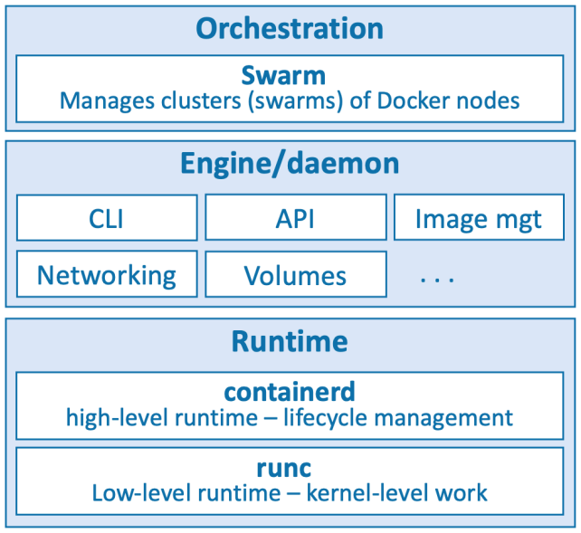
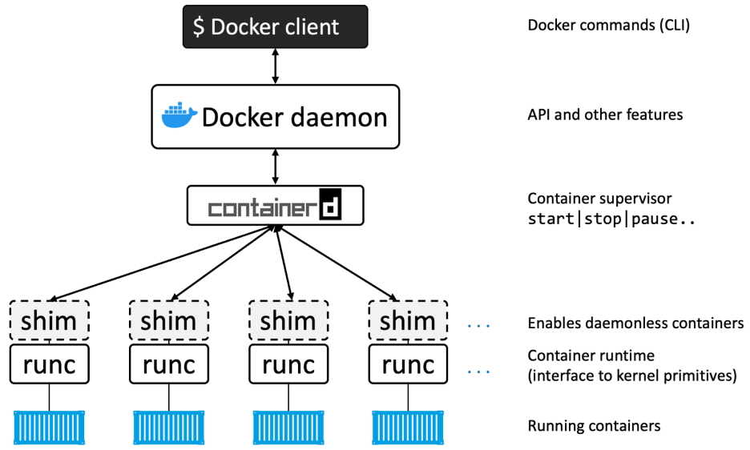

# Docker Notes

Learning path from Docker Deep Dive of Nigel Poulton (2023 Edition)

## Chapter 1 - Containers from 30,000 feet

### Kubernetes

_(pg. 19)_

Kubernetes is an open-source project out of Google that has quickly emergered as the de factor orchestrator of containerized apps.

Kubernetes used to use Docker as its default **container runtime** - the low-level technology that pulls images and starts and stops containers. However, modern Kubernetes clusters have a pluggable **container runtime interface** (CRI) that makes it easy to swap-out different container runtimes.

Most new Kubernetes clusters use **containerd** which is the small specialized part of Docker that does the low-level tasks of starting and stopping containers.

## Chapter 2 - Docker

### Parts of Docker

1. Runtime
2. Daemon (a.k.a. engine)
3. Orchestrator

- The low-level runtime is called **runc** and is the reference implementation of Open Containers Initiative (OCI) runtime-spect. Its job is to interface with the underlying OS and start and stop containers. Every container on a Docker node was created and started by an instance of **runc**.

- The high-level runtime is called **containerd**. This manages the entire container lifecycle including pulling images and managing runc instances.

- The Docker daemon (dockerd) sits above containerd and performs higher-level tasks such as exposing the Docker API, managing images, managing volumes, managing networks, and more.

## Chapter 4 - The Big Picture

<table>
  <thead>
    <tr>
      <th>Command</th>
      <th>Other Options</th>
      <th>Page</th>
    </tr>
  </thead>
  <tbody>
    <tr>
      <td><code>docker pull ubuntu:latest</code></td>
      <td>-</td>
      <td>38</td>
    </tr>
    <tr>
      <td><code>docker run -it ubuntu:latest /bin/bash</code></td>
      <td>-</td>
      <td>38</td>
    </tr>
    <tr>
      <td><code>ps -elf</code></td>
      <td>-</td>
      <td>39</td>
    </tr>
    <tr>
      <td><code>docker ps</code></td>
      <td><code>-a</code></td>
      <td>39</td>
    </tr>
    <tr>
      <td><code>docker images</code></td>
      <td>-</td>
      <td>43</td>
    </tr>
    <tr>
      <td><code>docker exec -it container_name bash</code></td>
      <td>-</td>
      <td>40</td>
    </tr>
    <tr>
      <td><code>docker stop container_name</code></td>
      <td>-</td>
      <td>40</td>
    </tr>
    <tr>
      <td><code>docker rm container_name</code></td>
      <td>-</td>
      <td>40</td>
    </tr>
    <tr>
      <td><code>ls -</code></td>
      <td>-</td>
      <td>42</td>
    </tr>
    <tr>
      <td><code>cat Dockerfile</code></td>
      <td>-</td>
      <td>42</td>
    </tr>
    <tr>
      <td><code>docker build -t test:latest .</code></td>
      <td>-</td>
      <td>42</td>
    </tr>
     <tr>
      <td><code>docker run -d --name web1 --publish 8080:8080 test:latest</code></td>
      <td>-</td>
      <td>42</td>
    </tr>
  </tbody>
</table>

## Chapter 5 - The Docker Engine

_(pg. 53)_

When you run a `docker run` command into the Docker CLI, the Docker client converts them into the appropriate API payload and POSTs them to the API endpoint exposed by the Docker daemon.

Once the daemon receives the command to create a new container, it makes a call to containerd. Remember that the daemon no longer contains any code to create containers!

## Chapter 6 - Images

<table>
  <thead>
    <tr>
      <th>Command</th>
      <th>Other Options</th>
      <th>Page</th>
    </tr>
  </thead>
  <tbody>
    <tr>
      <td><code>docker images --filter dangling=true</code></td>
      <td>
        <code>before</code>,
        <code>since</code>,
        <code>label</code>,
        <code>reference="*:latest"</code>
      </td>
      <td>66</td>
    </tr>
    <tr>
      <td><code>docker image prune</code></td>
      <td>
        <code>-a</code>,
        <code>before</code>,
        <code>since</code>,
        <code>label</code>,
        <code>reference="*:latest"</code>
      </td>
      <td>66</td>
    </tr>
    <tr>
      <td><code>docker inspect image:tag</code></td>
      <td>-</td>
      <td>69</td>
    </tr>
    <tr>
      <td><code>docker pull -a</code></td>
      <td>-</td>
      <td>72</td>
    </tr>
    <tr>
      <td><code>docker images</code></td>
      <td><code>--digests</code></td>
      <td>73</td>
    </tr>
    <tr>
      <td><code>docker rmi image_name</code></td>
      <td>-</td>
      <td>73</td>
    </tr>
    <tr>
      <td><code>docker manifest inspect remote_image_name | grep "architecture\|os"</code></td>
      <td>-</td>
      <td>77</td>
    </tr>
    <tr>
      <td><code>docker buildx build --platform linux/arm/v7 -t myimage:armv7 .</code></td>
      <td>-</td>
      <td>77</td>
    </tr>
    <tr>
      <td><code>docker manifest create</code></td>
      <td>-</td>
      <td>77</td>
    </tr>
    <tr>
      <td><code>docker stop $(ps -a -q)</code></td>
      <td>-</td>
      <td>79</td>
    </tr>
    <tr>
      <td><code>docker remove $(ps -a -q)</code></td>
      <td>-</td>
      <td>79</td>
    </tr>
    <tr>
      <td><code>docker rmi $(docker images -q)</code></td>
      <td><code>-f</code></td>
      <td>79</td>
    </tr>
  </tbody>
</table>
