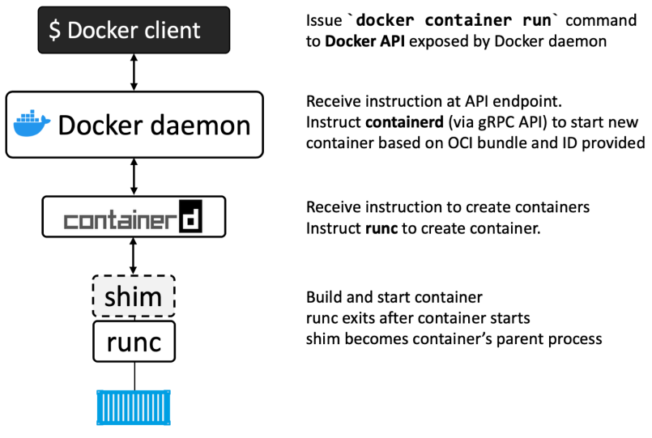

# Docker Notes

Learning path from Docker Deep Dive of Nigel Poulton (2023 Edition)

TODO: Explore [Dockerfile Reference](https://docs.docker.com/engine/reference/builder/)

## Chapter 1 - Containers from 30,000 feet

### Kubernetes

_(pg. 19)_

Kubernetes is an open-source project out of Google that has quickly emergered as the de factor orchestrator of containerized apps.

Kubernetes used to use Docker as its default **container runtime** - the low-level technology that pulls images and starts and stops containers. However, modern Kubernetes clusters have a pluggable **container runtime interface** (CRI) that makes it easy to swap-out different container runtimes.

Most new Kubernetes clusters use **containerd** which is the small specialized part of Docker that does the low-level tasks of starting and stopping containers.

## Chapter 2 - Docker

### Parts of Docker

1. Runtime
2. Daemon (a.k.a. engine)
3. Orchestrator

- The low-level runtime is called **runc** and is the reference implementation of Open Containers Initiative (OCI) runtime-spec. Its job is to interface with the underlying OS and start and stop containers. Every container on a Docker node was created and started by an instance of **runc**.

- The high-level runtime is called **containerd**. This manages the entire container lifecycle including pulling images and managing runc instances.

- The Docker daemon (dockerd) sits above containerd and performs higher-level tasks such as exposing the Docker API, managing images, managing volumes, managing networks, and more.


## Chapter 4 - The Big Picture

<table>
  <thead>
    <tr>
      <th>Command</th>
      <th>Other Options</th>
      <th>Page</th>
    </tr>
  </thead>
  <tbody>
    <tr>
      <td><code>docker pull ubuntu:latest</code></td>
      <td>-</td>
      <td>38</td>
    </tr>
    <tr>
      <td><code>docker run -it ubuntu:latest /bin/bash</code></td>
      <td><code>--dns</code>, <code>--dns-search</code></td>
      <td>38</td>
    </tr>
    <tr>
      <td><code>ps -elf</code></td>
      <td>-</td>
      <td>39</td>
    </tr>
    <tr>
      <td><code>docker ps</code></td>
      <td><code>-a</code></td>
      <td>39</td>
    </tr>
    <tr>
      <td><code>docker images</code></td>
      <td>-</td>
      <td>43</td>
    </tr>
    <tr>
      <td><code>docker exec -it container_name bash</code></td>
      <td>-</td>
      <td>40</td>
    </tr>
    <tr>
      <td><code>docker stop container_name</code></td>
      <td>-</td>
      <td>40</td>
    </tr>
    <tr>
      <td><code>docker rm container_name</code></td>
      <td>-</td>
      <td>40</td>
    </tr>
    <tr>
      <td><code>ls -l</code></td>
      <td>-</td>
      <td>42</td>
    </tr>
    <tr>
      <td><code>cat Dockerfile</code></td>
      <td>-</td>
      <td>42</td>
    </tr>
    <tr>
      <td><code>docker build -t test:latest .</code></td>
      <td>-</td>
      <td>43</td>
    </tr>
     <tr>
      <td><code>docker run -d --name web1 --publish 8080:8080 test:latest</code></td>
      <td>-</td>
      <td>43</td>
    </tr>
  </tbody>
</table>

## Chapter 5 - The Docker Engine

_(pg. 53)_


When you run a `docker run` command into the Docker CLI, the Docker client converts them into the appropriate API payload and POSTs them to the API endpoint exposed by the Docker daemon.

Once the daemon receives the command to create a new container, it makes a call to containerd. Remember that the daemon no longer contains any code to create containers!



## Chapter 6 - Images

<table>
  <thead>
    <tr>
      <th>Command</th>
      <th>Other Options</th>
      <th>Page</th>
    </tr>
  </thead>
  <tbody>
    <tr>
      <td><code>docker images --filter dangling=true</code></td>
      <td>
        <code>before</code>,
        <code>since</code>,
        <code>label</code>,
        <code>reference="*:latest"</code>
      </td>
      <td>66</td>
    </tr>
    <tr>
      <td><code>docker image prune</code></td>
      <td>
        <code>-a</code>,
        <code>before</code>,
        <code>since</code>,
        <code>label</code>,
        <code>reference="*:latest"</code>
      </td>
      <td>66</td>
    </tr>
    <tr>
      <td><code>docker inspect image:tag</code></td>
      <td>-</td>
      <td>69</td>
    </tr>
    <tr>
      <td><code>docker pull -a repository_name</code></td>
      <td>-</td>
      <td>72</td>
    </tr>
    <tr>
      <td><code>docker images</code></td>
      <td><code>--digests</code></td>
      <td>73</td>
    </tr>
    <tr>
      <td><code>docker rmi image_name</code></td>
      <td>-</td>
      <td>73</td>
    </tr>
    <tr>
      <td><code>docker manifest inspect remote_image_name | grep "architecture\|os"</code></td>
      <td>-</td>
      <td>77</td>
    </tr>
    <tr>
      <td><code>docker image inspect local_image_name | grep "Architecture\|Os"</code></td>
      <td>-</td>
      <td>-</td>
    </tr>
    <tr>
      <td><code>docker buildx build --platform linux/arm/v7 -t myimage:armv7 .</code></td>
      <td>-</td>
      <td>78</td>
    </tr>
    <tr>
      <td><code>docker manifest create</code></td>
      <td>-</td>
      <td>78</td>
    </tr>
    <tr>
      <td><code>docker stop $(ps -a -q)</code></td>
      <td>-</td>
      <td>79</td>
    </tr>
    <tr>
      <td><code>docker remove $(ps -a -q)</code></td>
      <td>-</td>
      <td>79</td>
    </tr>
    <tr>
      <td><code>docker rmi $(docker images -q)</code></td>
      <td><code>-f</code></td>
      <td>79</td>
    </tr>
  </tbody>
</table>

## Chapter 7 - Containers

<table>
  <thead>
    <tr>
      <th>Command</th>
      <th>Other Options</th>
      <th>Page</th>
    </tr>
  </thead>
  <tbody>
    <tr>
      <td><code>docker run --name neversaydie -it --restart always alpine sh</code></td>
      <td><code>--restart unless-stopped</code>, <code>--restart on-failure</code></td>
      <td>94</td>
    </tr>
    <tr>
      <td><code>docker inspect neversaydie | grep "RestartCount"</code></td>
      <td>-</td>
      <td>94</td>
    </tr>
    <tr>
      <td><code>docker inspect --format="{{json .Config.Entrypoint}}" container_name</code></td>
      <td>-</td>
      <td>98</td>
    </tr>
  </tbody>
</table>

## Chapter 8 - Containerizing an App

### Containerize a Single-Container App

<table>
  <thead>
    <tr>
      <th>Command</th>
      <th>Other Options</th>
      <th>Page</th>
    </tr>
  </thead>
  <tbody>
    <tr>
      <td><code>docker tag ddd-book:ch8.1 teriz/ddd-book:ch8.1</code></td>
      <td>-</td>
      <td>109</td>
    </tr>
    <tr>
      <td><code>docker push teriz/ddd-book:ch8.1</code></td>
      <td>-</td>
      <td>110</td>
    </tr>
    <tr>
      <td><code>docker history image_name</code></td>
      <td>-</td>
      <td>112</td>
    </tr>
  </tbody>
</table>

### Multi-Stage Builds

<table>
  <thead>
    <tr>
      <th>Command</th>
      <th>Other Options</th>
      <th>Page</th>
    </tr>
  </thead>
  <tbody>
    <tr>
      <td><code>docker build -t multi-stage/client --target prod-client -f Dockerfile-final .</code></td>
      <td>-</td>
      <td>118</td>
    </tr>
    <tr>
      <td><code>docker build -t multi-stage/server --target prod-server -f Dockerfile-final .</code></td>
      <td>-</td>
      <td>118</td>
    </tr>
  </tbody>
</table>

### Multi-Platform Builds

<table>
  <thead>
    <tr>
      <th>Command</th>
      <th>Other Options</th>
      <th>Page</th>
    </tr>
  </thead>
  <tbody>
    <tr>
      <td><code>docker buildx version</code></td>
      <td>-</td>
      <td>119</td>
    </tr>
    <tr>
      <td><code>docker buildx create --driver=docker-container --name=container</code></td>
      <td>-</td>
      <td>119</td>
    </tr>
    <tr>
      <td>
        <code>docker buildx build --builder=builder_name --platform=your_list -t image_name:tag --push .</code>
      </td>
      <td><code>--squash</code></td>
      <td>119</td>
    </tr>
    <tr>
      <td><code>docker buildx stop builder_name</code></td>
      <td>-</td>
      <td>-</td>
    </tr>
  </tbody>
</table>

## Chapter 9 - Multi-Container Apps with Compose

<table>
  <thead>
    <tr>
      <th>Command</th>
      <th>Other Options</th>
      <th>Page</th>
    </tr>
  </thead>
  <tbody>
    <tr>
      <td><code>docker compose version</code></td>
      <td>-</td>
      <td>128</td>
    </tr>
    <tr>
      <td><code>docker compose up</code></td>
      <td><code>&</code>, <code>--detach</code></td>
      <td>132</td>
    </tr>
    <tr>
      <td><code>docker compose up -f prod-equus-bass.yml up &</code></td>
      <td>-</td>
      <td>133</td>
    </tr>
    <tr>
      <td><code>docker network ls</code></td>
      <td>-</td>
      <td>134</td>
    </tr>
    <tr>
      <td><code>docker volume ls</code></td>
      <td>-</td>
      <td>134</td>
    </tr>
    <tr>
      <td><code>docker compose down</code></td>
      <td><code>--volumes</code>, <code>--rmi (all|local)</code></td>
      <td>135</td>
    </tr>
    <tr>
      <td><code>docker compose ps</code></td>
      <td><code>a</code></td>
      <td>136</td>
    </tr>
    <tr>
      <td><code>docker compose top</code></td>
      <td>-</td>
      <td>136</td>
    </tr>
    <tr>
      <td><code>docker compose stop</code></td>
      <td>-</td>
      <td>137</td>
    </tr>
    <tr>
      <td><code>docker compose rm</code></td>
      <td>-</td>
      <td>137</td>
    </tr>
    <tr>
      <td><code>docker compose restart</code></td>
      <td>-</td>
      <td>137</td>
    </tr>
    <tr>
      <td><code>docker compose ls</code></td>
      <td>-</td>
      <td>137</td>
    </tr>
    <tr>
      <td><code>docker volume inspect multi-container_counter-vol</code></td>
      <td>-</td>
      <td>138</td>
    </tr>
  </tbody>
</table>

## Chapter 10 - Docker Swarm

**Pre-requisites:** Set-up nodes with [Multipass](./multipass.md) or [PlayWithDocker](https://labs.play-with-docker.com/)

### Build a Secure Swarm Cluster

<table>
  <thead>
    <tr>
      <th>Command</th>
      <th>Other Options</th>
      <th>Page</th>
    </tr>
  </thead>
  <tbody>
    <tr>
      <td>
        <code>docker swarm init <nobr>--advertise-addr</nobr> 10.0.0.1:2377 <nobr>--listen-addr</nobr> 10.0.0.1:2377</code>
      </td>
      <td><code><nobr>--autolock=true</nobr></code></td>
      <td>148</td>
    </tr>
    <tr>
      <td><code>docker node ls</code></td>
      <td>-</td>
      <td>148</td>
    </tr>
    <tr>
      <td><code>docker swarm join-token worker</code></td>
      <td>-</td>
      <td>149</td>
    </tr>
    <tr>
      <td><code>docker swarm join-token manager</code></td>
      <td>-</td>
      <td>149</td>
    </tr>
    <tr>
      <td>
        <code>docker swarm join --token manager_or_worker_token leader_ip <nobr>--advertise-addr</nobr> this_ip <nobr>--listen-addr this_ip</nobr></code>
      </td>
      <td>-</td>
      <td>150</td>
    </tr>
    <tr>
      <td><code>docker swarm update --autolock=true</code>
      </td>
      <td>-</td>
      <td>153</td>
    </tr>
    <tr>
      <td><code>docker swarm unlock</code>
      </td>
      <td>-</td>
      <td>153</td>
    </tr>
    <tr>
      <td><code>docker swarm unlock-key</code>
      </td>
      <td>-</td>
      <td>153</td>
    </tr>
    <tr>
      <td><code>docker node update --availability (active|pause|drain) manager1</code>
      </td>
      <td>-</td>
      <td>154</td>
    </tr>
  </tbody>
</table>

### Deploying Swarm Services

<table>
  <thead>
    <tr>
      <th>Command</th>
      <th>Other Options</th>
      <th>Page</th>
    </tr>
  </thead>
  <tbody>
    <tr>
      <td><code>docker service create --name web-fe -p 8080:8080 --replicas 5 image</code></td>
      <td><code>--mode global</code></td>
      <td>155</td>
    </tr>
    <tr>
      <td><code>docker service ls</code></td>
      <td>-</td>
      <td>156</td>
    </tr>
    <tr>
      <td><code>docker service ps web-fe</code></td>
      <td>-</td>
      <td>156</td>
    </tr>
    <tr>
      <td><code>docker service inspect --pretty web-fe</code></td>
      <td>-</td>
      <td>157</td>
    </tr>
    <tr>
      <td><code>docker service scale web-fe=10</code></td>
      <td>-</td>
      <td>158</td>
    </tr>
    <tr>
      <td><code>docker service rm web-fe</code></td>
      <td>-</td>
      <td>159</td>
    </tr>
    <tr>
      <td><code>docker network create -d overlay uber-net</code></td>
      <td>-</td>
      <td>160</td>
    </tr>
    <tr>
      <td><code>docker network ls</code></td>
      <td>-</td>
      <td>160</td>
    </tr>
    <tr>
      <td>
        <code>docker service create --name uber-service <nobr>--network</nobr> uber-net <nobr>-p</nobr> 8080: <nobr>--replicas</nobr> 12 <nobr>nigelpoulton/ddd-book:web0.1</nobr></code>
      </td>
      <td>-</td>
      <td>161</td>
    </tr>
    <tr>
      <td>
        <code>docker service update <nobr>--image</nobr> nigelpoulton/ddd-book:web0.2 <nobr>--update-parallelism</nobr> 2 <nobr>--update-delay</nobr> 20s uber-service</code>
      </td>
      <td>-</td>
      <td>163</td>
    </tr>
  </tbody>
</table>

#### More on `docker network ls`

Lists all the network the daemon knows about. This includes network that span across multiple hosts in a cluster.

```bash
[worker1] (local) root@192.168.0.13 ~
$ docker network ls
NETWORK ID     NAME              DRIVER    SCOPE
1624a8193671   bridge            bridge    local
78bed499d0c5   docker_gwbridge   bridge    local
81b60bc9270a   host              host      local
f9b63ydlmtph   ingress           overlay   swarm
02f1bcc66615   none              null      local
```

In Docker Swarm, the network named _ingress_ is a built-in overlay network used for internal communication among the nodes in the swarm.

Other networks like `bridge`, `docker_gwbridge`, `host`, and `none` are standard networks with different purposes.

The ingress network is used by the swarm to route traffic route between services running on different nodes. It provides a way for containers on different nodes to communicate with each other seamlessly.

If you want more detailed information about the ingress network or other swarm-related details, you can use:

`docker network inspect ingress`

When you create a new overlay network (`uber-net`) and update a service's (`uber-service`) network to use this newly created overlay network, it doesn't affect the default ingress network directly. The ingress network remains a fundamental part of the Docker Swarm for internal communication between services, regardless of additional overlay networks you create.

The ingress network is used for routing traffice between services running on different nodes in the Docker Swarm. It is not replaced or superseded by other overlay networks; instead, overlay networks are additional and can be used for specific purposes.

The tasks of the service can then communicate using both the default ingress network and the new overlay network. It doesn't replace or remove the ingress network; it simply extends the network capabilities of the service.

### Troubleshooting

<table>
  <thead>
    <tr>
      <th>Command</th>
      <th>Other Options</th>
      <th>Page</th>
    </tr>
  </thead>
  <tbody>
    <tr>
      <td><code>docker service logs</code></td>
      <td><code>--details</code>, <code>--follow</code>, <code>tail</code></td>
      <td>165</td>
    </tr>
  </tbody>
</table>

## Chapter 11 - Docker Networking

<table>
  <thead>
    <tr>
      <th>Command</th>
      <th>Other Options</th>
      <th>Page</th>
    </tr>
  </thead>
  <tbody>
    <tr>
      <td><code>docker inspect bridge</code></td>
      <td><code>| grep "bridge.name"</code></td>
      <td>179</td>
    </tr>
    <tr>
      <td><code>docker network create -d bridge local-net</code></td>
      <td>-</td>
      <td>180</td>
    </tr>
    <tr>
      <td><code>docker run -d --name c1 --network local-net alpine sleep 1d</code></td>
      <td>-</td>
      <td>181</td>
    </tr>
    <tr>
      <td><code>docker inspect your-network</code></td>
      <td>-</td>
      <td>181</td>
    </tr>
    <tr>
      <td>
        <code>docker network create -d macvlan --subnet=10.0.0.0/24 --ip-range=10.0.0.0/25 --gateway=10.0.0.1 -o parent=eth0.100 macvlan 100</code>
      </td>
      <td>-</td>
      <td>187</td>
    </tr>
    <tr>
      <td><code>docker logs container_name</code></td>
      <td>-</td>
      <td>190</td>
    </tr>
    <tr>
      <td>
        <code>docker service create -d --name svc1 --publish published=5001,target=80,mode=host ngnix</code>
      </td>
      <td>-</td>
      <td>194</td>
    </tr>
    <tr>
      <td><code>docker network prune</code></td>
      <td>-</td>
      <td>196</td>
    </tr>
    <tr>
      <td><code>docker network rm network_name</code></td>
      <td>-</td>
      <td>196</td>
    </tr>
  </tbody>
</table>
