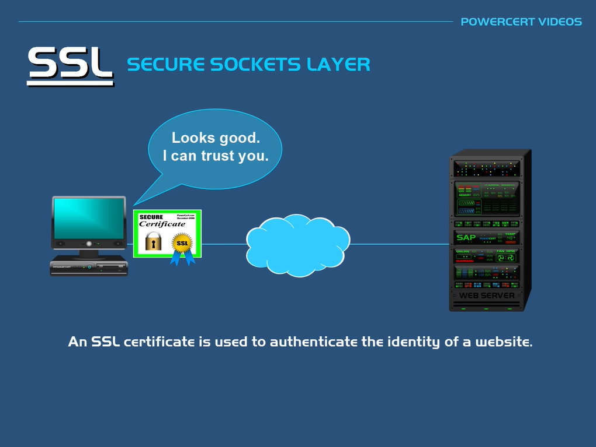
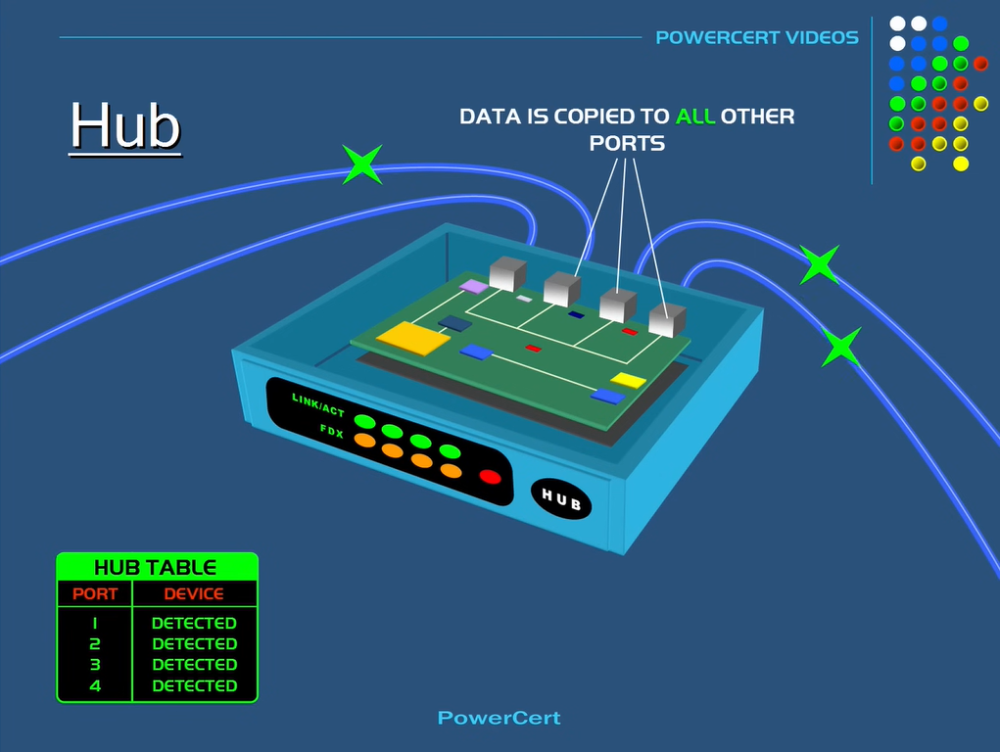
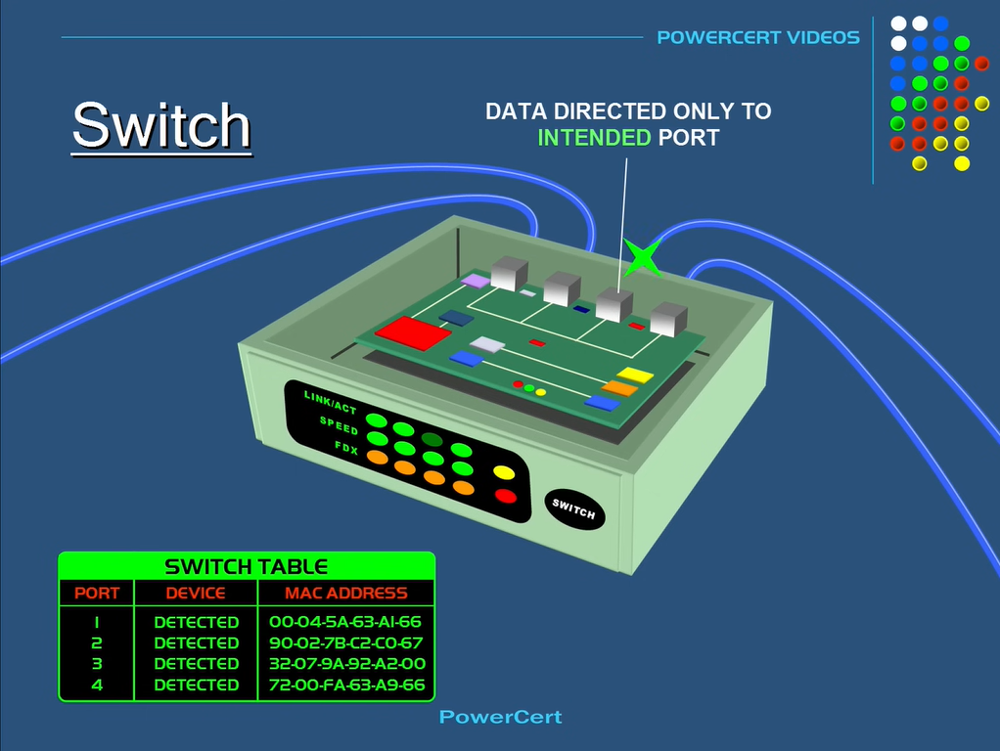
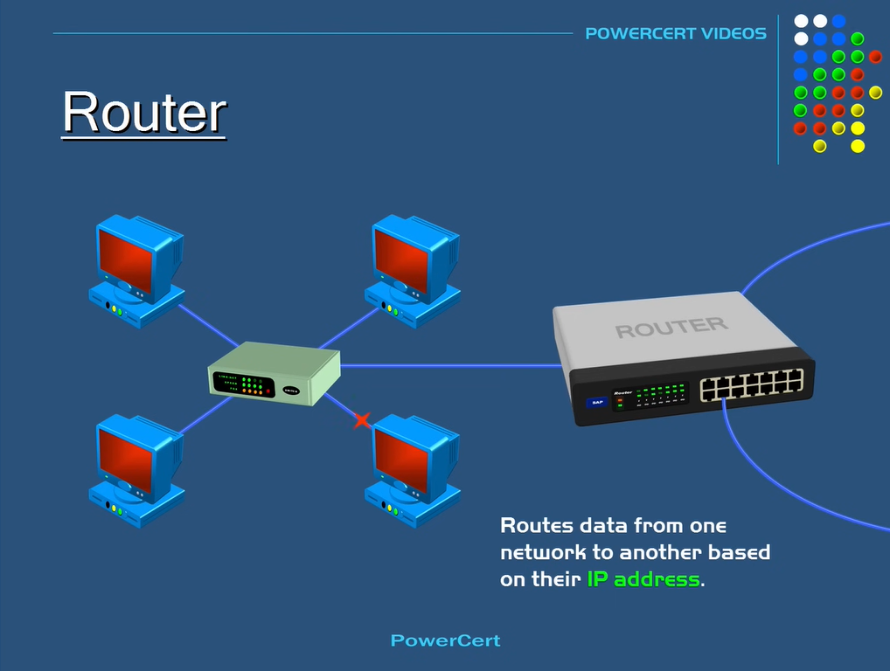

# SSL vs. TLS

From [Power Cert](https://www.youtube.com/watch?v=hExRDVZHhig)

- HTTPS protects data by using one of two protocols.

## Secure Sockets Layer (SSL)

- SSL is a protocol that's used to ensure security on the Internet.
- Uses **public key encryption** to secure data.
- When a computer connects to a website using SSL, the computer's web browser will ask the website to identify itself. Then, the web server will send the computer a copy of its SSL certificate.
- **SSL certificate** is a small digital certificate that is used to authenticate the identity of a website. Basically, it's used to let your computer know that the website you're visiting is trustworthy.
- So then, the computer's browser will check to make sure that it trusts the certificate. And if it does, it will send a message to the web server.
- The web server will then respond with an acknowledgement so an SSL session can proceed. Encrypted data can now be exchanged between your computer and the web server.

## Transport Layer Security (TLS)

- TLS is the latest industry standard cryptographic protocol.
- The successor to SSL.
- Like SSL, it also authenticates the server, client, and encrypts the data.

# Hubs, Switch, & Router

From [Power Cert](https://www.youtube.com/watch?v=1z0ULvg_pW8)

## Hubs

- The purpose of a hub is to connect all of your network devices together on an internal network.
- It's a device that has multiple ports that accepts Ethernet connections from network devices.
- A hub is considered not to be intelligent because it does not filter any data. It also doesn't know where data is supposed to be sent.
- The only thing a hub knows is when a device is connected to one of its ports.
- A hub re-broadcasts data to every port that has a device connected to it. This not only creates security concerns, but it also creates unnecessary traffic on the network which wastes bandwidth.

## Switch

- A switch is very similar to a hub. It's also a device that has multiple ports that accepts Ethernet connections from network devices.
- But unlike a hub, a switch is intelligent. A switch can actually learn the physical addresses of the devices that are connected to it.
- When a data packet arrives at the switch, the switch will look at its table of MAC addresses and matching ports. It will then send the data to the intended port.

## Routers

- **Hubs** and **switches** are used to exchange data within a local area network, such as in your home network or in a business.
- They are not used to exchange data outside of their own network, such as out on the Internet.
- To exchange data outside their own network, a device needs to be able to read IP addresses. Hubs and switches do not read IP addresses.
- That's where a router comes in. A **router** is a device that routes or forwards data from one network to another based on their IP address.
- When a data packet is received from the router, the router inspects the data's IP address and determines if the packet was meant for its own network or if its meant for another network.
- The router is the gateway of a network.
- Hubs and switches are used to create networks.
- Routers are used to connect networks.

# NFS vs SMB

- Both are file sharing protocols designed to allow client systems to access files over a computer network.

## Network File System (NFS)

- NFS' are typically used for Linux and Unix systems

## Server Message Block (SMB)

- SMBs are mostly used for Windows systems.

# TODO

- Add [VLAN Explained](https://www.youtube.com/watch?v=jC6MJTh9fRE)
- Add [Subnets vs. VLANs](https://www.youtube.com/watch?v=6_giEv20En0)
